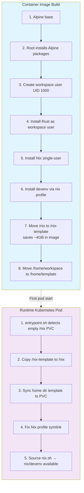
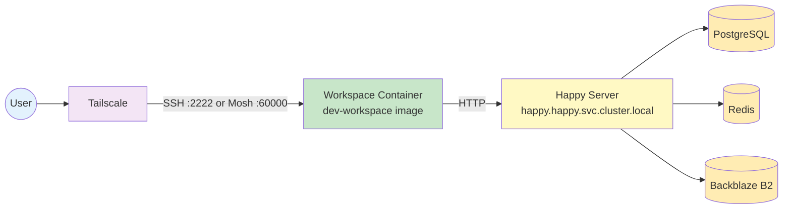

+++
date = '2025-01-05T00:00:00+01:00'
draft = false
hidden = true
publishdate = '2026-01-31T00:00:00+01:00'
tags = ['kubernetes', 'claude-code', 'happy', 'self-hosted', 'homelab']
title = "I'm an Happy engineer now"
+++

I'm now officially a Happy engineer!

In this post, I'll explain what Happy is, why I decided to self-host it, and how my setup works.

<!--more-->
<!-- toc -->

## Why I'm Happy

The name of this post isn't just a clever play on words. I truly am a happier engineer thanks to AI-assisted coding.

I had many ideas and too little time to work on everything. The frustrating part wasn't programming itself - it was the gap between imagination and available hours. As I [wrote on Hacker News](https://news.ycombinator.com/item?id=45881365):

> I truly enjoy programming, but the most frustrating part for me was that I had many ideas and too little time to work on everything. Thanks to AI I can now work on many side projects at the time, and most importantly just get stuff done quickly and most of the time in good enough (or sometimes excellent) results. I'm both amazed and a bit sad, but the reality is that my output has increased significantly - although the quality might have dropped a bit in certain areas. Time is limited, and if I can increase my results in the same way as the electric street lights, I can simply look back at the past and smile that I lived in a time where lighting up gas-powered street lights was considered a skill. As you perfectly put it, it's not about the process per se, it's about the result. And the result is that now the lights are only 80% lit. In a few months / years we'll probably reach the threshold where the electric street lights will be brighter than the gas-powered ones, and you'd be a fool if you decide to still light them up one by one.

With the same amount of time I can now build more things. The output increase is significant. It's not about the process, it's about the result. And Happy + Claude Code makes this possible from anywhere - my Daylight DC-1, my phone, or my desktop.

## What is Happy?

[Happy](https://happy.engineering) is an open-source mobile and web client for Claude Code and OpenAI's Codex, built by the community. It lets you use Claude Code from your phone, tablet, or browser instead of being tied to a terminal or tmux session.

Key features:
- **Mobile & Web access** - Use Claude Code from iOS, Android, or browser
- **Real-time voice** - Speak commands and watch them execute (not just dictation)
- **End-to-end encryption** - Uses TweetNaCl (same as Signal), zero-knowledge architecture
- **Session sync** - Continue conversations across devices
- **Push notifications** - Get alerted when input is needed

I mostly use Happy on mobile devices (my [Daylight DC-1](https://www.daylightcomputer.com/dc-1) tablet and smartphone), so I do sync sessions between these two devices. When I need to continue a session on my desktop, I simply push my code to Git, pull it on my computer, and start fresh with a new context. This workflow works well for me and avoids sync-related issues.

To get started, simply run:
```bash
npm i -g happy-coder && happy
```

The project consists of several components:
- [happy](https://github.com/slopus/happy) - Mobile and web client (React Native)
- [happy-cli](https://github.com/slopus/happy-cli) - CLI to connect your local Claude Code to mobile device
- [happy-server](https://github.com/slopus/happy-server) - Backend server

## Why I self-hosted

I started using the public Happy server a while ago. However, over time, the API endpoint started timing out frequently, and eventually, it stopped working altogether. This is documented in [slopus/happy#295](https://github.com/slopus/happy/issues/295).

Since I rely on Claude Code for my daily work, I needed a reliable solution. The answer was clear: self-host the Happy server.

## The Happy Server Stack

My Happy server runs on Kubernetes with the following components:

| Component | Description |
|-----------|-------------|
| **Happy Server** | Node.js/Express server (`ghcr.io/denysvitali/happy-server`) on port 3000 |
| **PostgreSQL** | CloudNativePG cluster (1 instance, 10Gi storage on Longhorn) |
| **Redis** | Single replica Redis 7 Alpine for caching/sessions |
| **S3 Storage** | Backblaze B2 for file storage |

The server is exposed via Tailscale using service annotations (`tailscale.com/hostname: happy`), and secrets are pulled from OpenBao. The deployment uses an init container to run `npx prisma migrate deploy` before the main app starts.

### Tailscale Integration

Both the Happy server and my workspaces are exposed via Tailscale:
- **Happy Server**: `happy.<tailnet>.ts.net` - accessible from any Tailscale-connected device
- **Workspaces**: Each workspace gets a Tailscale hostname like `workspace-denys.<tailnet>.ts.net`

This means I can connect from my phone, laptop, or any device with Tailscale installed without exposing services to the public internet. The Kubernetes Tailscale Operator handles the network configuration automatically.

## Patching the Android App

I also use Happy on my Android phone. However, I had to patch the Android app because my Kubernetes cluster uses a private CA, and the default Happy mobile apps won't trust my certificate. I submitted a fix in [slopus/happy#278](https://github.com/slopus/happy/pull/278).

The PR added:
- Android network security config to allow custom CAs
- GitHub Actions CI for building APKs automatically
- Release APK builds instead of debug builds for standalone usage
- Caching and parallel execution for faster builds
- Parallel builds across CPU architectures (ABIs)

### Annoyances

There's also a persistent bug ([slopus/happy#236](https://github.com/slopus/happy/issues/236)) where the Android app incorrectly reports a "call" as active when the app is open or in the background. This happens 100% of the time on Android and is particularly annoying when connected via Bluetooth (car, headphones) - the audio playback stops to let the app handle the "call" (TTS output). To make the device stop reporting a call in progress to Bluetooth devices, the app must be force closed.

## LLM Release Lag

One downside of using a third-party app that's not perfectly maintained is that new LLM releases often lag behind. For example, when Anthropic released Opus 4.5, it wasn't immediately available in the Happy Android app. Users had to wait for the app to be updated with the new model list.

A workaround existed ([slopus/happy#244](https://github.com/slopus/happy/issues/244#issuecomment-3577085895)) where users could manually configure the model, but this wasn't documented well and required technical knowledge.

This is one of the trade-offs of relying on community-maintained software rather than the official clients. The app has only 17 contributors and updates depend on their free time.

## My LLM Setup

Currently, I'm using Happy with three different models depending on the task:

### LLM Comparison

| Model | Plan | Cost | Best For |
|-------|------|------|----------|
| **MiniMax M2.1** | [Starter](https://api.minimax.io/pricing) | $2 first month, then $10/month | Lightweight tasks, quick one-shots |
| **GLM 4.7** | [Lite](https://open.bigmodel.cn/) | $6/month (valid to 2026-01-23) | Frontend, general coding |
| **Claude Opus 4.5** | [Pro](https://www.anthropic.com/claude-code) | $17/month | Complex planning, multi-step tasks |

#### [MiniMax M2.1](https://api.minimax.io/pricing)

**What I like:**
- Very cheap, especially the $2 first month offer
- Never stops - can run 1+ hour sessions without issues
- Usage limits are very generous
- Output is very good, sometimes even better than Claude Opus 4.5 for certain tasks
- Surprisingly excellent at one-shotting stuff

**Weaknesses:**
- Not great at frontend development

---

#### [GLM 4.7](https://open.bigmodel.cn/) (Zhipu AI)

**What I like:**
- Very cheap at $6/month (or ~$3 via the coding plan)
- 3× usage of Claude Pro plan limits - very generous
- Open source model
- Surprisingly good at frontend and other tasks
- Compatible with 10+ coding tools (Claude Code, Cursor, Cline, Kilo Code...)
- "They cooked" - excellent results overall

**Weaknesses:**
- Validity period on the cheap plan (need to renew)
- Less familiar to Western developers

---

#### [Claude Opus 4.5](https://www.anthropic.com/claude-code) (via Claude Code Pro)

**What I like:**
- Excellent output quality generally
- Strong planning capabilities
- Now works with Pro plan (previously required Max for Opus 4.5)

**Weaknesses:**
- Very expensive compared to alternatives
- Hit usage limits frequently, especially on Pro
- Stops often during sessions
- Planning features are difficult to use on mobile

---

### Why Three Models?

I use MiniMax for quick tasks and one-shots where I need speed and low cost. GLM 4.7 is my go-to for frontend work where it surprisingly excels. Claude Opus 4.5 is reserved for complex multi-step tasks that require careful planning.

To make this work, the `happy daemon` needs to be started with specific environment variables. I use a simple setup script that I source when needed:

```bash
~$ cat ~/setup-minimax.sh
#!/bin/bash
export ANTHROPIC_BASE_URL=https://api.minimax.io/anthropic
export ANTHROPIC_AUTH_TOKEN=foo
export ANTHROPIC_DEFAULT_OPUS_MODEL="MiniMax-M2.1"
export ANTHROPIC_DEFAULT_SONNET_MODEL="MiniMax-M2.1"
export ANTHROPIC_DEFAULT_HAIKU_MODEL="MiniMax-M2.1"
# export ANTHROPIC_DEFAULT_HAIKU_MODEL="MiniMax-M2.1-lightning"
```

## The Workspace Setup

Each workspace is a complete development environment using my custom [dev-workspace](https://github.com/denysvitali/dev-workspace) container image. The workspace runs entirely as non-root for Kubernetes Pod Security Standards (restricted) compliance.

### Workspace Features

The dev-workspace image is a **containerized development environment** designed for Kubernetes deployments with SSH access.

#### Core Architecture

| Aspect | Implementation |
|--------|----------------|
| **Base Image** | Alpine Linux (minimal footprint) |
| **User Model** | Non-root user (UID 1000) from build to runtime |
| **SSH Server** | Dropbear on port 2222 (non-privileged) |
| **Multi-Arch** | Built for both AMD64 and ARM64 |
| **Persistence** | Template-based PVC pattern for home + nix-store |

#### Pre-installed Tools

**Shell & CLI Utilities:**
- Modern coreutils replacements: `bat`, `exa`, `fd`, `ripgrep`, `fzf`, `btop`
- Shells: `bash`, `zsh` with autosuggestions/syntax highlighting
- Terminal multiplexers: `tmux`, `screen`

**Languages & Package Managers:**
- Rust (via rustup)
- Go
- Python 3 + `uv` package manager
- Node.js + npm/pnpm
- **Nix** (single-user mode) with devenv

**DevOps & Development:**
- kubectl, GitHub CLI, Docker client
- SSH tools: dropbear, mosh, openssh-client
- Network tools: tcpdump, nmap, bind-tools, rsync

#### Security & Operational Features

1. **Rootless Operation**: All processes run as non-root user
2. **SSH Key Authentication Only**: No password logins
3. **Dynamic Host Keys**: Generated at runtime per pod instance
4. **Graceful Signal Handling**: Proper SIGTERM cleanup
5. **Health Checks**: Built-in dropbear + user shell verification
6. **Tailscale Integration**: Offloaded to Kubernetes Operator (not bundled)

#### Nix/Devenv Setup

The workspace uses **single-user Nix** to maintain rootless container compatibility:



The Nix store (~4GB) is stored as `/nix-template` in the image and copied to the PVC on first run. This saves ~4GB by storing nix only once in the image.

#### CI/CD Pipeline

- Multi-platform builds (AMD64 + ARM64) via GitHub Actions
- Flattens images for smaller size
- Auto-generates SBOM (Bill of Materials) via `generate-bom` script
- Manifest creation for multi-arch support

#### NetworkPolicy

The workspace only allows egress to:
- Tailscale namespace
- DNS (kube-dns)
- Happy server (`happy.happy.svc.cluster.local`)

#### Storage

Each workspace gets **60Gi storage** on Longhorn:
- 50Gi for the Nix store (persists across restarts)
- Remaining space for home directory and user data

Longhorn provides snapshots and backups. I configure automatic snapshots hourly and daily backups to an off-cluster backup target for disaster recovery.

### MCP Tools

I use a GitHub PAT with access limited to only my authorized repositories. Within my workspace, I have several Model Context Protocol (MCP) servers configured to help me work with my projects:

- **[gh-actions-mcp](https://github.com/denysvitali/gh-actions-mcp)** - Interact with GitHub Actions. Check workflow status, list workflows, and manage runs directly from Claude Code.

- **[argocd-mcp](https://github.com/denysvitali/argocd-mcp)** - Manage ArgoCD projects, applications, and repositories. Deploy, sync, and rollback applications without leaving the terminal.

- **[woodpecker-ci-mcp](https://github.com/denysvitali/woodpecker-ci-mcp)** - Access Woodpecker CI build statuses, manage pipelines, and retrieve logs for debugging CI failures.

### Data Flow



## Why Not Claude Code via SSH?

In the past, I used Claude Code directly in a terminal by SSH-ing into my container. This worked, but it was inconvenient for several reasons:

1. **Multiple TUI issues**: Claude Code's terminal UI has some quirks when running over SSH
2. **Mobile pain point**: Using tmux on a mobile device (via Termux or similar) is cumbersome
3. **Keyboard autocomplete**: Typing every single character without keyboard autocomplete support was frustrating

Happy solves these issues by providing a proper client-server architecture that works great on mobile devices. The iOS app is even optimized for iPad and supports:
- Dark theme
- Audio mode
- Custom server URLs
- Better permissions UI
- New session creation remotely

## Lessons Learned

Before wrapping up, here are some key takeaways from setting up this infrastructure:

1. **Private CA handling requires code changes**: If you're self-hosting with a private Kubernetes cluster, be prepared to patch the mobile apps to trust your CA. The default trust stores won't include your internal certificate authority.

2. **Community-maintained clients lag behind**: The Happy app has only 17 contributors, so new Anthropic model releases aren't always immediately available. Having alternative providers (MiniMax, GLM) as fallbacks is essential.

3. **Tailscale makes remote access trivial**: By offloading Tailscale to the Kubernetes Operator, I didn't need to bundle the Tailscale client in my workspace image. This keeps the image smaller and more secure.

4. **MCP servers enhance workflow**: Having gh-actions-mcp, argocd-mcp, and woodpecker-ci-mcp integrated with Claude Code enables powerful workflows without leaving the terminal.

5. **Environment variables work for now**: The current workaround for using multiple LLM providers requires setting environment variables before starting `happy daemon`. A native configuration file would be cleaner.

## Conclusion

Self-hosting Happy has given me a reliable way to use Claude Code across all my devices. While it required some patching and customization, the flexibility and control are worth it. If you're interested in a similar setup, check out [Happy](https://happy.engineering), the [Happy repository](https://github.com/slopus/happy), and my Kubernetes configuration.
