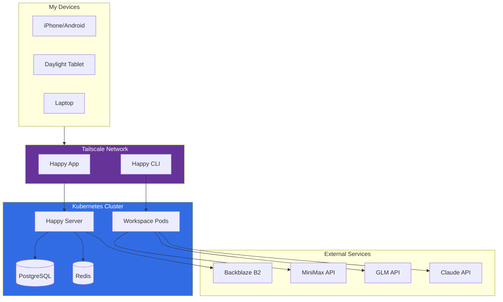

+++
date = '2025-01-05T00:00:00+01:00'
draft = false
hidden = true
publishdate = '2026-01-06T00:00:00+01:00'
tags = ['kubernetes', 'claude-code', 'happy', 'self-hosted', 'homelab']
title = "I'm a Happy engineer now"
+++

I'm now officially a Happy engineer!

In this post, I'll explain what Happy is, why I decided to self-host it, and how my setup works.

Happy is becoming more and more my IDE. With MCP tool integration and remote development capabilities, I rarely need a traditional setup anymore.

<!--more-->
<!-- toc -->

## Why I'm Happy

The name of this post isn't just a clever play on words. I truly am a *happier* engineer thanks to AI-assisted coding.

I had many ideas and too little time to work on everything. The frustrating part wasn't programming itself - it was the gap between imagination and available hours. As I [wrote on Hacker News](https://news.ycombinator.com/item?id=45881365):

> I truly enjoy programming, but the most frustrating part for me was that I had many ideas and too little time to work on everything.
> Thanks to AI I can now work on many side projects at a time, and most importantly just get things done quickly and most of the time in good enough (or sometimes excellent) results.

With the same amount of time I can now build more things. The output increase is significant. It's not about the process, it's about the result, and Happy + Claude Code makes this possible from anywhere.

## What is Happy?

[Happy](https://happy.engineering) is an open-source mobile and web client for Claude Code and OpenAI's Codex, built by the community. It lets you use Claude Code from your phone, tablet, or browser instead of being tied to a terminal or tmux session.

Key features:
- **Mobile & Web access** - Use Claude Code from iOS, Android, or browser
- **Real-time voice** - Speak commands and watch them execute (not just dictation)
- **End-to-end encryption** - Uses TweetNaCl (same as Signal), zero-knowledge architecture
- **Session sync** - Continue conversations across devices
- **Push notifications** - Get alerted when input is needed

I haven't used the TTS or voice input features yet - the text interface is already powerful enough for my needs.

I mostly use Happy on mobile devices (my [Daylight DC-1](https://daylightcomputer.com/product) tablet and smartphone), syncing sessions between them. When I need to continue a session on my desktop, I push my code to Git, pull it on my computer, and start fresh with a new context. This workflow works well for me and avoids sync-related issues.

To get started, simply run:
```bash
npm i -g happy-coder && happy
```

The project consists of several components:
- [happy](https://github.com/slopus/happy) - Mobile and web client (React Native)
- [happy-cli](https://github.com/slopus/happy-cli) - CLI to connect your local Claude Code to mobile device
- [happy-server](https://github.com/slopus/happy-server) - Backend server

## Why I self-hosted

I started using the public Happy server a while ago. However, over time, the API endpoint started timing out frequently, and eventually, it stopped working altogether. This is documented in [slopus/happy#295](https://github.com/slopus/happy/issues/295).

Since I rely on Claude Code for my daily work, I needed a reliable solution. The answer was clear: self-host the Happy server.

### Prerequisites

To replicate this setup, you'll need a running Kubernetes cluster with the following components:

| Component | Purpose | My Choice |
|-----------|---------|-----------|
| **Kubernetes cluster** | Container orchestration | Self-hosted (k3s) |
| **Tailscale Operator** | Secure network access | Kubernetes Operator |
| **Persistent Storage** | Database & file storage | Longhorn |
| **PostgreSQL** | Happy server database | CloudNativePG |
| **Secrets Management** | API keys, credentials | OpenBao |
| **Object Storage** | File uploads | Backblaze B2 |

Setting up a homelab cluster from scratch is a significant undertaking. I documented my journey in [postmarketOS-powered Kubernetes cluster](/posts/pmos-k3s-cluster/), which covers running Kubernetes on old smartphones.

## Why Not Claude Code via SSH?

In the past, I used Claude Code directly in a terminal by SSH-ing into my container. This worked, but it was inconvenient for several reasons:

1. **TUI flickering**: Claude Code's terminal UI flickers and behaves erratically when running over SSH, making it frustrating to use
2. **Key combination problems**: Mobile SSH clients struggle with essential key combinations like `Ctrl+A`, `Ctrl+E`, or `Shift+Tab` that Claude Code relies on
3. **No text correction or autocomplete**: Every character must be typed perfectly - no autocorrect, no word suggestions, no keyboard autocomplete
4. **Copy/paste is painful**: Copying code snippets or multi-line prompts into an SSH session on mobile is clunky and error-prone
5. **Readability issues**: Terminal text renders too small on mobile screens, making code review difficult

Happy solves these issues by providing a proper client-server architecture that works great on mobile devices. The mobile app features a dark theme, audio mode, custom server URLs, a better permissions UI, and the ability to create new sessions remotely. Text input on mobile is finally a first-class citizen.

## The Happy Server Stack

My Happy server runs on Kubernetes with the following components:

| Component | Description |
|-----------|-------------|
| **Happy Server** | Node.js/Express server (`ghcr.io/denysvitali/happy-server`) on port 3000 |
| **PostgreSQL** | CloudNativePG cluster (1 instance, 10Gi storage on Longhorn) |
| **Redis** | Single replica Redis 7 Alpine for caching/sessions |
| **S3 Storage** | Backblaze B2 for file storage |



The server is exposed via Tailscale using service annotations (`tailscale.com/hostname: happy`), and secrets are pulled from [OpenBao](https://github.com/openbao/openbao), HashiCorp's open-source secrets management fork.

The deployment uses an init container to run `npx prisma migrate deploy` before the main app starts, ensuring the database schema is up-to-date before accepting connections.

### Tailscale Integration

Both the Happy server and my workspaces are exposed via Tailscale:
- **Happy Server**: `happy.<tailnet>.ts.net` - accessible from any Tailscale-connected device
- **Workspaces**: Each workspace gets a Tailscale hostname like `workspace-denys.<tailnet>.ts.net`

This means I can connect from my phone, laptop, or any device with Tailscale installed without exposing services to the public internet. The Kubernetes Tailscale Operator handles the network configuration automatically, eliminating the hassle of configuring mTLS certificates - Tailscale handles all authentication and encryption at the network level.

The security trade-off is worth noting: anyone with access to your Tailscale network can reach these services. I mitigate this by only authorizing trusted devices to my tailnet. If needed, I can SSH directly into any workspace container for debugging.

## Patching the Android App

I also use Happy on my Android phone. However, I had to patch the Android app because my Kubernetes cluster uses a private CA, and the default Happy mobile apps won't trust my certificate. I submitted a fix in [slopus/happy#278](https://github.com/slopus/happy/pull/278).

If you're self-hosting with a private Kubernetes cluster, be prepared to patch the mobile apps to trust your CA. The default trust stores won't include your internal certificate authority. However, with Tailscale you can skip TLS entirely since Tailscale already encrypts the connection.

> [!NOTE]
> Tailscale's encryption means you don't need TLS termination at all. This simplifies configuration and eliminates certificate management overhead - a significant advantage over traditional VPN solutions.

### Annoyances

One quirk on Android: the app tells Bluetooth devices it's on a call, even when voice interaction isn't being used. This means audio playback is interrupted when the app is open.

## My LLM Setup

I've configured my Happy setup to use different LLM providers depending on the task. This gives me flexibility to optimize for cost, speed, or capability as needed.

Currently, I'm using Happy with three different models:

### LLM Comparison

| Model | Plan | Cost | Best For |
|-------|------|------|----------|
| **MiniMax M2.1** | [Starter](https://platform.minimax.io/subscribe/coding-plan) | $2 first month, then $10/month | Lightweight tasks, quick one-shots |
| **GLM 4.7** | [Lite](https://z.ai/subscribe) | $6/month (valid to 2026-01-23) | Frontend, general coding |
| **Claude Opus 4.5** | [Pro](https://claude.com/product/claude-code) | $17/month | Complex planning, multi-step tasks |

I use MiniMax for quick tasks and one-shots where I need speed and low cost. GLM 4.7 is my go-to for frontend work where it surprisingly excels. Claude Opus 4.5 is reserved for complex multi-step tasks that require careful planning.

### Provider Switching

Switching between LLM providers (MiniMax, GLM, Anthropic) isn't something you can do at session creation time in the mobile app. The provider configuration is applied to the `happy daemon` when it starts. The community is working on this - [PR #272](https://github.com/slopus/happy/pull/272) adds one-touch profiles and multi-backend support.

To make this work, the `happy daemon` needs to be started with specific environment variables. I use a simple setup script that I source when needed:

```bash
~$ cat ~/setup-minimax.sh
#!/bin/bash
export ANTHROPIC_BASE_URL=https://api.minimax.io/anthropic
export ANTHROPIC_AUTH_TOKEN=foo
export ANTHROPIC_DEFAULT_OPUS_MODEL="MiniMax-M2.1"
export ANTHROPIC_DEFAULT_SONNET_MODEL="MiniMax-M2.1"
export ANTHROPIC_DEFAULT_HAIKU_MODEL="MiniMax-M2.1"
# export ANTHROPIC_DEFAULT_HAIKU_MODEL="MiniMax-M2.1-lightning"
```

## The Workspace Setup

When you create a session in Happy, it spawns a **workspace** - a complete development environment running in a Kubernetes pod. Each workspace gives you an isolated shell where Claude Code can read files, run commands, and manage your codebase.

I use a custom [dev-workspace](https://github.com/denysvitali/dev-workspace) container image that provides everything I need for development. The workspace runs entirely as a non-root user for Kubernetes Pod Security Standards (restricted) compliance.

### Workspace Features

The dev-workspace image is a **containerized development environment** designed for Kubernetes deployments with SSH access.

#### Core Architecture

| Aspect | Implementation |
|--------|----------------|
| **Base Image** | Alpine Linux (minimal footprint) |
| **User Model** | Non-root user (UID 1000) from build to runtime |
| **SSH Server** | Dropbear on port 2222 (non-privileged) |
| **Multi-Arch** | Built for both AMD64 and ARM64 |
| **Persistence** | Template-based PVC (PersistentVolumeClaim) pattern for home + nix-store |

#### Pre-installed Tools

**Shell & CLI Utilities:**
- Modern coreutils replacements: `bat`, `exa`, `fd`, `ripgrep`, `fzf`, `btop`
- Shells: `bash`, `zsh` with autosuggestions/syntax highlighting
- Terminal multiplexers: `tmux`, `screen`

**Languages & Package Managers:**
- Rust (via rustup)
- Go
- Python 3 + `uv` package manager
- Node.js + npm/pnpm
- **Nix** (single-user mode) with devenv

**DevOps & Development:**
- kubectl, GitHub CLI, Docker client
- SSH tools: dropbear, mosh, openssh-client
- Network tools: tcpdump, nmap, bind-tools, rsync

#### Security & Operational Features

1. **Rootless Operation**: All processes run as non-root user
2. **SSH Key Authentication Only**: No password logins
3. **Dynamic Host Keys**: Generated at runtime per pod instance
4. **Graceful Signal Handling**: Proper SIGTERM cleanup
5. **Health Checks**: Built-in dropbear + user shell verification
6. **Tailscale Integration**: Offloaded to Kubernetes Operator (not bundled)

#### Nix/Devenv Setup

The workspace uses **single-user Nix** to maintain rootless container compatibility. The Nix store (~4GB) is stored as `/nix-template` in the image and copied to the PVC on first run, saving ~4GB by storing nix only once in the image.

#### CI/CD Pipeline

- Multi-platform builds (AMD64 + ARM64) via GitHub Actions
- Flattens images for smaller size
- Auto-generates SBOM (Bill of Materials) via `generate-bom` script
- Manifest creation for multi-arch support

#### NetworkPolicy

The workspace only allows egress to:
- Tailscale namespace
- DNS (kube-dns)
- Happy server (`happy.happy.svc.cluster.local`)

#### Storage

Each workspace gets **60Gi storage** on Longhorn:
- 50Gi for the Nix store (persists across restarts)
- Remaining space for home directory and user data

Longhorn provides snapshots and backups. I configure automatic snapshots hourly and daily backups to an off-cluster backup target for disaster recovery.

### MCP Tools

I use a GitHub Personal Access Token (PAT) with access limited to only my authorized repositories. Within my workspace, I have several [Model Context Protocol (MCP)](https://modelcontextprotocol.io/) servers configured via `~/.config/claude/mcp.json` to help me work with my projects:

- **[gh-actions-mcp](https://github.com/denysvitali/gh-actions-mcp)** - Interact with GitHub Actions. Check workflow status, list workflows, and manage runs directly from Claude Code.

- **[argocd-mcp](https://github.com/denysvitali/argocd-mcp)** - Manage ArgoCD projects, applications, and repositories. Deploy, sync, and rollback applications without leaving the terminal.

- **[woodpecker-ci-mcp](https://github.com/denysvitali/woodpecker-ci-mcp)** - Access Woodpecker CI build statuses, manage pipelines, and retrieve logs for debugging CI failures.

> [!WARNING]
> My current approach uses a single workspace for convenience. For stronger security isolation, consider running one workspace per repository with individual GitHub PATs for each - that way a compromised token only affects one repo.

For my personal use case, the convenience of a shared workspace outweighs the security trade-off. Your tolerance for this risk may vary depending on your threat model.

### Quick Reference

| Component | Technology | Access |
|-----------|------------|--------|
| Happy Client | iOS/Android/Web | Tailscale network |
| Happy Server | k8s + Node.js | `happy.<tailnet>.ts.net` |
| Workspaces | dev-workspace container | SSH :2222 via Tailscale |
| LLM Providers | MiniMax / GLM / Claude | Via Happy |
| Secrets | OpenBao | Kubernetes integration |
| Storage | Longhorn (60Gi) | Persistent volumes |

### Monthly Costs

| Service | Cost |
|---------|------|
| **LLM APIs** | ~$25/month (MiniMax $10 + GLM $6 + Claude Pro $17) |
| **Backblaze B2** | ~$5/month for file storage |
| **Tailscale** | Free for personal use |
| **Kubernetes** | Self-hosted (no cloud costs) |

## Conclusion

Self-hosting Happy has given me a reliable way to use Claude Code across all my devices. While it required some patching and customization, the flexibility and control are worth it.

### Getting Started

If you're interested in a similar setup, here's how to begin:

1. **Try the public server first**: Run `npm i -g happy-coder && happy` to test Happy with the default public server
2. **Explore the ecosystem**: Check out [Happy](https://happy.engineering), the [Happy repository](https://github.com/slopus/happy), and the [community Discord](https://discord.gg/Happy)
3. **Consider self-hosting**: If you need reliability, ensure you have a running Kubernetes cluster and review the prerequisites in this post

### Resources

- [Happy Official Site](https://happy.engineering)
- [Happy GitHub](https://github.com/slopus/happy)
- [My dev-workspace image](https://github.com/denysvitali/dev-workspace)
- [Kubernetes configuration](https://github.com/denysvitali/homelab) (coming soon)
