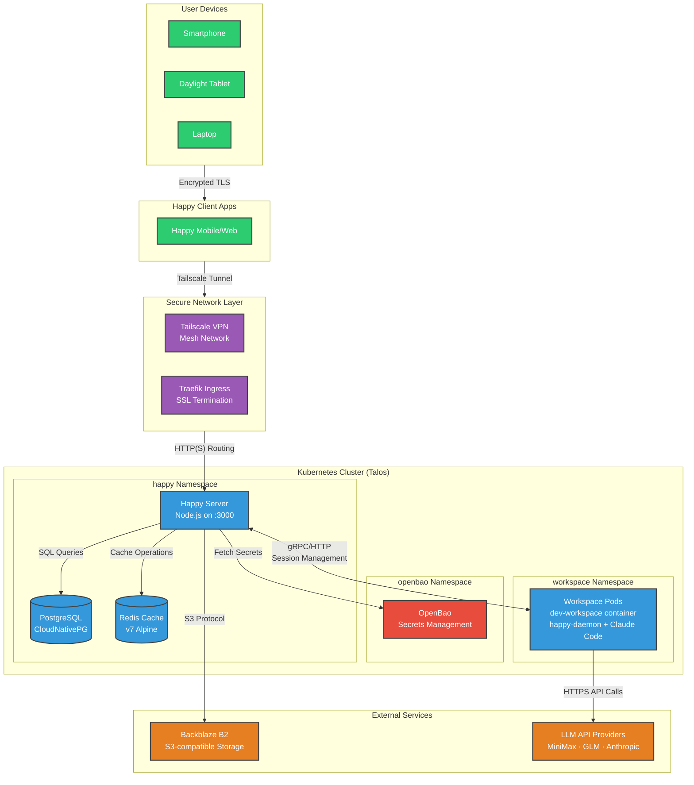

+++
date = '2026-01-12T00:00:00+01:00'
summary = 'I explain what Happy is, why I self-host it, and how my Kubernetes-based setup works with multiple LLM providers.'
draft = false
publishdate = '2026-01-12T00:00:00+01:00'
tags = ['kubernetes', 'claude-code', 'happy', 'self-hosted', 'homelab']
title = "I'm a Happy engineer now"
+++

> [!NOTE]
> This post is published, but I continue to refine its contents—sometimes multiple times per hour. Perfectionism shouldn't prevent sharing useful information.

I'm now officially a Happy engineer!

In this post, I'll explain what Happy is, why I decided to self-host it, and how my setup works. I'll also share practical details about my LLM provider strategy, workspace configuration, and the lessons I learned along the way.

Happy is becoming more than just a tool—it's evolving into my primary development environment. With MCP tool integration and remote development capabilities, I rarely need a traditional IDE setup anymore.

<!--more-->
<!-- toc -->

## Why I'm Happy

The title of this post isn't just a clever play on words. I genuinely am a *happier* engineer thanks to AI-assisted coding.

Like many developers, I struggled with the gap between having ideas and having time to implement them. The frustration wasn't programming itself—I love writing code. The problem was scale: I had countless side project ideas and far too few hours to make them reality. As I [wrote on Hacker News](https://news.ycombinator.com/item?id=45881365):

> I truly enjoy programming, but the most frustrating part for me was that I had many ideas and too little time to work on everything.
> Thanks to AI I can now work on many side projects at a time, and most importantly just get things done quickly and most of the time in good enough (or sometimes excellent) results.

AI assistance has transformed my development workflow. I can now tackle multiple projects simultaneously, ship features faster, and spend less time on repetitive tasks. The productivity boost is substantial—not because I'm writing more code, but because I'm focusing on the right problems: architecture, design, and creative solutions rather than boilerplate and debugging.

What makes this truly powerful is mobility. Happy + Claude Code means I'm no longer tethered to my desk. I can review pull requests during my commute, debug issues while waiting in line, or deploy updates from my couch. The ability to make progress from anywhere—on a tablet, a phone, or a laptop—has fundamentally changed how I approach software development.

## What is Happy?

[Happy](https://happy.engineering) is an open-source mobile and web client for Claude Code, built by the community to untether your AI-assisted development from a traditional terminal. Think of it as a remote control for your coding environment—one that works from your phone, tablet, or browser instead of locking you into a tmux session or SSH connection. The [official documentation](https://happy.engineering/docs/) covers everything in depth, but here's the practical overview.

### Core Features

- **Mobile & Web Access** - Use Claude Code from iPhone, Android, or any modern browser
- **Real-Time Voice** - Speak commands naturally and watch them execute live (not simple dictation—actual command parsing and execution)
- **End-to-End Encryption** - Zero-trust architecture with secure key exchange keeps your code private
- **Session Sync** - Start a conversation on your phone, continue on your laptop—everything stays in sync
- **Push Notifications** - Get alerted when Claude needs your input, so you never miss a beat

### How I Actually Use It

I primarily use Happy on mobile devices—specifically my [Daylight DC-1](https://daylightcomputer.com/product) tablet and smartphone—leveraging the [real-time sync feature](https://happy.engineering/docs/features/real-time-sync/) to maintain continuity across devices. I haven't deeply explored the voice features yet; the text interface has proven more than sufficient for my workflow.

The official documentation asks rhetorically:

> Are you actually trying to write code on your phone?
> No. Absolutely not. That would be miserable to spend all day on my phone.

But I've found a different use case that's equally valuable: **micro-sessions** throughout the day. When I'm commuting, waiting in line, or just away from my workstation, Happy lets me make progress in bite-sized chunks. It's not about replacing my desk—it's about reclaiming dead time.

#### A Real Example

Here's how this works in practice: I recently needed to deploy Jellyfin to my home Kubernetes cluster while I was out running errands. Instead of waiting until I got home, I opened Happy on my phone and had a conversation:

```
"Set up Jellyfin in my cluster using Helm via GitOps"
```

Happy connected to my workspace, generated the Helm chart configuration, created the pull request to my GitOps repository, and handled the deployment—all while I was walking to the grocery store. By the time I got home, Jellyfin was running. No laptop required, no SSH pain, just a quick conversation from my phone.

This is the real power of Happy: it transforms those "I'll handle this later" tasks into "I'll handle this now" moments.

### Getting Started

If you want to try Happy with the public server, installation is straightforward. First, ensure you have the latest LTS version of [Node.js](https://nodejs.org/) installed, then run:

```bash
npm install -g happy-coder && happy
```

This will install the Happy CLI and launch the setup wizard, which will guide you through connecting to the public Happy server or configuring your own.

### Project Architecture

Happy is modular by design, consisting of three main components:

- **[happy](https://github.com/slopus/happy)** - The mobile and web client (built with React Native)
- **[happy-cli](https://github.com/slopus/happy-cli)** - CLI tool that bridges your local Claude Code installation to mobile devices
- **[happy-server](https://github.com/slopus/happy-server)** - Backend server that handles authentication, session management, and device synchronization

## Why I self-hosted

> [!NOTE]
> **Not everyone needs to self-host!** If the public Happy server works well for you, there's no need to run your own infrastructure. Self-hosting is only necessary if you encounter reliability issues (see [slopus/happy#295](https://github.com/slopus/happy/issues/295)) or want full control over your setup.

I started using the public Happy server a while ago. However, over time, the API endpoint started timing out frequently, and eventually, it stopped working altogether.

Since I rely on Claude Code for my daily work, I needed a reliable solution. The answer was clear: self-host the Happy server.

### Prerequisites

To self-host Happy like I do, you'll need a Kubernetes cluster with the following components:

| Component | Purpose | Recommended Implementation |
|-----------|---------|---------------------------|
| **Kubernetes cluster** | Container orchestration | Any K8s distribution (v1.27+) |
| **Tailscale Operator** | Secure network access | [Tailscale Kubernetes Operator](https://tailscale.com/kb/1236/kubernetes-operator/) |
| **Persistent Storage** | Database & file storage | Longhorn, Ceph, Rook, or cloud storage |
| **PostgreSQL** | Happy server database | [CloudNativePG](https://cloudnative-pg.io/) operator (v1.28+) |
| **Secrets Management** | API keys, credentials | OpenBao, HashiCorp Vault, or Kubernetes Secrets |
| **Object Storage** | File uploads | Backblaze B2, MinIO, or S3-compatible storage |

My cluster runs on [Talos Linux](https://www.talos.dev/), a purpose-built OS for Kubernetes that simplifies cluster management and provides enhanced security through its immutable infrastructure approach. If you're just getting started with Kubernetes, consider lighter alternatives like [k3s](https://k3s.io/) or [microk8s](https://microk8s.io/) for testing before deploying to production.

## Why Not Claude Code via SSH?

In the past, I used Claude Code directly in a terminal by SSH-ing into my container. This worked, but it was inconvenient for several reasons:

1. **TUI flickering**: Claude Code's terminal UI flickers and behaves erratically when running over SSH, making it frustrating to use
2. **Key combination problems**: Mobile SSH clients struggle with essential key combinations like `Ctrl+A`, `Ctrl+E`, or `Shift+Tab` that Claude Code relies on
3. **No text correction or autocomplete**: Every character must be typed perfectly - no autocorrect, no word suggestions, no keyboard autocomplete
4. **Copy/paste is painful**: Copying code snippets or multi-line prompts into an SSH session on mobile is clunky and error-prone
5. **Readability issues**: Terminal text renders too small on mobile screens, making code review difficult

Happy solves these issues by providing a proper client-server architecture that works great on mobile devices. The mobile app features a dark theme, [audio mode](https://happy.engineering/docs/features/voice-coding-with-claude-code/), custom server URLs, a better permissions UI, and the ability to create new sessions remotely. Text input on mobile is finally a first-class citizen.

## The Happy Server Stack

My self-hosted Happy server runs on Kubernetes as a coordinated set of services. Here's what powers it:

| Component | Technology | Purpose |
|-----------|------------|---------|
| **Happy Server** | Node.js/Express (`ghcr.io/denysvitali/happy-server`) | Main API server on port 3000 |
| **PostgreSQL** | CloudNativePG (1 replica, 10Gi on Longhorn) | Persistent data storage |
| **Redis** | Redis 7 Alpine (single replica) | Caching and session management |
| **Object Storage** | Backblaze B2 (S3-compatible) | File uploads and attachments |

**Production Features:**

The Happy Server deployment includes several production-ready configurations:
- **Pod Disruption Budget**: Ensures minimum availability during maintenance
- **Resource Limits**: 128Mi/100m requests, 512Mi limits for predictable performance
- **Health Probes**: Liveness and readiness probes for automatic recovery
- **Automatic Secret Refresh**: ExternalSecrets operator updates secrets on change
- **Database Migration**: Init container runs `npx prisma migrate deploy` before startup

### System Architecture

Here's how everything connects together:



### How It Works

The architecture follows a clear flow:

1. **Client Connection**: Your Happy app (mobile or web) connects through Tailscale, creating a secure peer-to-peer tunnel to your cluster. All traffic is encrypted at the network layer via Tailscale's WireGuard protocol.
2. **Ingress Routing**: Traffic routes through Traefik to the Happy Server service. (For details on my Tailscale + Traefik setup, see my [Tailscale + Traefik + Private CA](/posts/tailscale-traefik-private-ca/) post.)
3. **Server Processing**: Happy Server handles authentication, session management, and user authentication.
4. **Session Management**: I use a single persistent workspace. When you create a session, the `happy-daemon` running inside the workspace spawns a new Claude instance, which then connects to your configured LLM provider.
5. **LLM Integration**: The wrapped `claude`  connects directly to your configured LLM provider (MiniMax, GLM, or Anthropic) via HTTPS API calls. This connection is independent of the Happy server and happens directly from the workspace pod.

### Database & Storage

The Happy Server uses an **init container** pattern to handle database migrations:

```bash
npx prisma migrate deploy
```

This runs Prisma migrations before the main container starts, ensuring your database schema is always up-to-date before the server accepts connections.

### Network Architecture

I use Tailscale for secure access combined with Traefik for ingress routing within the cluster. This hybrid approach keeps everything private within my tailnet—no open ports on the public internet. For full details on this setup, see my [Tailscale + Traefik + Private CA](/posts/tailscale-traefik-private-ca/) post.

## Patching the Android App

Due to my setup memtioned before, I am using an https endpoint signed with my personal CA. Unfortunately this is not supported by the Happy Android app. I therefore had to patch it and [opened a PR](https://github.com/slopus/happy/pull/278).

### Current Annoyances

Even with everything working, there's one quirk on Android: the app tells Bluetooth devices it's on a call, even when voice interaction isn't being used. This means audio playback is interrupted when the app is open. See [this issue report for the details](https://github.com/slopus/happy/issues/236).

## My LLM Setup

I've configured my Happy setup to use different LLM providers depending on the task at hand. This multi-provider approach gives me the flexibility to optimize for cost, speed, or capability based on what I'm trying to accomplish.

### Choosing the Right Model

Different tasks call for different tools. Here's how I think about it:

| Model | Plan | Cost | Best For |
|-------|------|------|----------|
| **MiniMax M2.1** | [Coding Plan](https://platform.minimax.io/subscribe/coding-plan) | **$2/month first month** (then $10/month) | Quick one-offs, simple refactors, routine tasks |
| **GLM 4.7** | [Lite](https://z.ai/subscribe) | $3-6/month (promotional pricing) | Frontend work, React/Vue components, general coding |
| **Gemini 3.0** | [Antigravity](https://antigravity.google) | Free but limited usage | Specialized tasks, UI debugging |
| **Claude Opus 4.5** | [Pro](https://claude.com/pricing) | $17-20/month | Complex planning, multi-step refactors, architecture |

**How I use them in practice:**

- **MiniMax** is my workhorse for fast, inexpensive tasks. When I need to quickly rename variables across a file, extract a function, or make routine changes, MiniMax gets the job done instantly at minimal cost. I find MiniMax M2.1 to be more "stubborn" than GLM 4.7. It can be annoying at times, but this stubbornness is actually useful for very long tasks where you don't want the model to drift too much. MiniMax is also super cheap with generous limits, which I love, though it honestly feels much "dumber" than GLM 4.7 overall.

- **GLM 4.7** is my go-to model these days. It surprises me with its frontend capabilities, CSS adjustments, and UI-related work remarkably well. If I'm building or modifying user interfaces, GLM is usually my first choice. What really impresses me is that at times GLM 4.7 is even better than Claude Opus 4.5, and I'm finding myself switching to it more and more. I'd also much rather spend my money on Z.AI's open source models that are pushing close to SOTA, knowing that my spending helps support open development, than pay the "Anthropic tax" and perpetuate their closed model ecosystem.

- **Gemini 3.0** (both Pro and Flash) via [Antigravity](https://antigravity.google) is my occasional tool for specialized tasks. Antigravity's UI debugging capability is fantastic. Being able to inspect and debug the interface directly is incredibly useful. That said, for most things GLM 4.7 is more than enough, so I only reach for Gemini when I need something specific.

- **Claude Opus 4.5** comes out for the heavy lifting. Complex refactors that require understanding multiple files, architectural decisions, or tasks that need careful planning and step-by-step execution—that's Opus territory. That being said, given Anthropic's January 2026 crackdown on third-party tools like OpenCode, where they suddenly flipped a switch with no warning and no migration path, blocking tools that were using Claude Pro / Max subscription OAuth tokens outside the official CLI - I'm actively trying to detach myself from Anthropic's ecosystem. They also cut off xAI's access around the same time (OpenAI had been blocked back in August 2025 for benchmarking). The writing is on the wall: Anthropic is building a walled garden, and I'd rather not build my workflow on a platform that might pull the plug on third-party integrations at any moment. As [paddo.dev](https://paddo.dev/blog/anthropic-walled-garden-crackdown/) put it: "The era of subscription arbitrage is over."

### How Provider Switching Works

Here's the current state of provider switching in Happy (as of this writing):

**The limitation:** You can't switch providers from within the Happy mobile app when creating a new session. The provider configuration is locked in when the `happy daemon` process starts in your workspace.

**The workaround:** I use shell scripts to set environment variables before starting the daemon. Each script configures a different provider by setting the `ANTHROPIC_*` environment variables that the daemon reads at startup.

**The future:** The Happy community is actively working on this. [PR #272](https://github.com/slopus/happy/pull/272) proposes one-touch profile switching and multi-backend support, which would make this much smoother.

### Setting Up Provider Scripts

Here's my practical setup. I maintain separate scripts for each provider and source the one I need before starting a session. For example:

**MiniMax configuration** (`~/setup-minimax.sh`):

```bash
#!/bin/bash
export ANTHROPIC_BASE_URL=https://api.minimax.io/anthropic
export ANTHROPIC_API_KEY=your-minimax-api-key
export ANTHROPIC_DEFAULT_OPUS_MODEL="MiniMax-M2.1"
export ANTHROPIC_DEFAULT_SONNET_MODEL="MiniMax-M2.1"
export ANTHROPIC_DEFAULT_HAIKU_MODEL="MiniMax-M2.1"
```


**Usage workflow:**

```bash
# Before creating the Happy daemon, pick your provider:
source ~/setup-minimax.sh
# OR
source ~/setup-zai.sh

# Then
happy daemon start
```

After sourcing the appropriate script, start the Happy daemon with your configured provider. This isn't seamless—it requires a bit of shell work before each set of sessions.

## The Workspace Setup

To run all my sessions I used a shared [dev-workspace](https://github.com/denysvitali/dev-workspace) container that provides everything I need for development. The workspace runs entirely as a non-root user for Kubernetes Pod Security Standards (restricted) compliance.

**Multi-User Support:**

The workspace system supports multiple users through a template-based approach:
- Each user gets their own workspace pod with isolated storage
- Individual PersistentVolumeClaims per workspace for data isolation
- Template-based workspace definitions for easy provisioning
- Per-user SSH keys for secure authentication
- Separate Nix stores to prevent conflicts between users

> [!TIP]
> While I currently use a single workspace for convenience, the template-based system makes it easy to provision separate workspaces for different users or projects. Each workspace has its own storage quota and SSH credentials, providing strong isolation between users.

### Workspace Features

The dev-workspace image is a **containerized development environment** designed for Kubernetes deployments with SSH access.

#### Core Architecture

| Aspect | Implementation |
|--------|----------------|
| **Base Image** | Alpine Linux (minimal footprint) |
| **User Model** | Non-root user (UID 1000) from build to runtime |
| **SSH Server** | Dropbear on port 2222 (non-privileged) |
| **Multi-Arch** | Built for both AMD64 and ARM64 |
| **Persistence** | Template-based PVC (PersistentVolumeClaim) pattern for home + nix-store |

#### Nix/Devenv Setup

The workspace uses **single-user Nix** to maintain rootless container compatibility. The Nix store (~4GB) is stored as `/nix-template` in the image and copied to the PVC on first run, saving ~4GB by storing nix only once in the image.

#### CI/CD Pipeline

- Multi-platform builds (AMD64 + ARM64) via GitHub Actions
- Flattens images for smaller size
- Auto-generates SBOM (Bill of Materials) via `generate-bom` script
- Manifest creation for multi-arch support

#### NetworkPolicy

The workspace employs strict network isolation for security:

**Egress restrictions** (blocks all private networks):
- Allows public internet access for LLM APIs and package downloads
- Allows DNS queries (kube-dns)
- Allows Happy server access (`happy.happy.svc.cluster.local`)
- Allows Tailscale namespace access for VPN connectivity
- Blocks all other private network ranges (10.0.0.0/8, 172.16.0.0/12, 192.168.0.0/16)

**Ingress restrictions**:
- Allows SSH access from Tailscale only (port 2222)
- Blocks all other inbound connections

This comprehensive network policy ensures that even if a workspace pod is compromised, it cannot access other services in the cluster or private networks.

#### Security Philosophy: Why I Run Agents in "YOLO Mode"

You might wonder why I bother with strict network isolation if I'm going to let AI agents run with minimal oversight. Here's my reasoning: I run my agents in what some might call "bypass permissions" mode—or as I like to think of it, "YOLO mode."

The magic of AI agents and LLMs is their ability to work autonomously. If I have to babysit them—approving every file read, every command execution, every tool call—then I might as well do the work myself. The whole point is that they can operate independently, making progress while I'm doing something else.

That said, I'm not reckless. I've made a calculated risk assessment:

**The worst that can happen:**
- My Personal Access Token leaks → I rotate it
- My repos get exposed → most are public already, and the private ones will be eventually
- The container goes rogue → I prune it and spin up a fresh one

**What I'm protecting against:**
- A rogue agent on my home network → unacceptable
- Unrestricted access to production infrastructure → unacceptable
- Compromised credentials affecting systems outside my control → unacceptable

By running agents in an isolated workspace with no local network access, I get the best of both worlds: the agents can work autonomously without constant approval, but they're contained in a sandbox where the blast radius is limited to things I can easily restore or replace. It's a balance between trusting the AI to do its job and maintaining sensible boundaries.

For me, this is the sweet spot. The convenience of autonomous agents far outweighs the minimal risk of a compromised workspace container, especially when that container can't touch anything critical.

#### Storage

Each workspace gets **60Gi storage** on Longhorn:
- 50Gi for the Nix store (persists across restarts)
- Remaining space for home directory and user data

### MCP Tools

I use a GitHub Personal Access Token (PAT) with access limited to only my authorized repositories. Within my workspace, I have several [Model Context Protocol (MCP)](https://modelcontextprotocol.io/) servers configured via `~/.config/claude/mcp.json` to help me work with my projects:

- **[gh-actions-mcp](https://github.com/denysvitali/gh-actions-mcp)** - Interact with GitHub Actions. Check workflow status, list workflows, and manage runs directly from Claude Code.

- **[argocd-mcp](https://github.com/denysvitali/argocd-mcp)** - Manage ArgoCD projects, applications, and repositories. Deploy, sync, and rollback applications without leaving the terminal.

- **[woodpecker-ci-mcp](https://github.com/denysvitali/woodpecker-ci-mcp)** - Access Woodpecker CI build statuses, manage pipelines, and retrieve logs for debugging CI failures.

> [!WARNING]
> My current approach uses a single workspace for convenience. For stronger security isolation, consider running one workspace per repository with individual GitHub PATs for each - that way a compromised token only affects one repo.

For my personal use case, the convenience of a shared workspace outweighs the security trade-off. Your tolerance for this risk may vary depending on your threat model.

> [!TIP]
> If you want better isolation without managing multiple workspaces, consider using [GitHub's fine-grained PATs](https://docs.github.com/en/authentication/keeping-your-account-and-data-secure/managing-your-personal-access-tokens#creating-a-fine-grained-personal-access-token) which can limit access to specific repositories and even specific permissions (read-only vs. read-write).

### Quick Reference

| Component | Technology | Access |
|-----------|------------|--------|
| Happy Client | Android/Web | Tailscale network |
| Happy Server | k8s + Node.js | `happy.<tailnet>.ts.net` |
| Workspaces | dev-workspace container | SSH :2222 via Tailscale |
| LLM Providers | MiniMax / GLM / Claude | Via Happy |
| Secrets | OpenBao | Kubernetes integration |
| Storage | Longhorn (60Gi) | Persistent volumes |

### Monthly Costs

| Service | Cost |
|---------|------|
| **LLM APIs** | ~$22-36/month (MiniMax $2-10 + GLM $3-6 + Claude Pro $17-20) |
| **Backblaze B2** | Negligible (I only use a few MBs for this) |
| **Tailscale** | [Free for personal use](https://tailscale.com/pricing) |
| **Kubernetes** | Self-hosted (no cloud costs) |

## Conclusion

Self-hosting Happy has given me a reliable, flexible way to use Claude Code across all my devices. The combination of Happy's mobile-first design, Claude Code's AI capabilities, and a well-architected Kubernetes backend creates a development experience that's both powerful and liberating.

The ability to work from anywhere - on my phone during my commute, on my tablet from the couch, or on my laptop at my desk - has transformed how I think about development. I'm no longer tied to a traditional workstation, and I can reclaim those small pockets of time throughout the day that would otherwise be lost.

Was it worth the effort? Absolutely. The setup needed a bit of time, but the payoff in terms of productivity and flexibility has been enormous. And now, thanks to this setup, I can further improve it from my Happy app.

### Getting Started

If you're interested in a similar setup, here's how to begin:

1. **Try the public server first**: Run `npm install -g happy-coder && happy` to test Happy with the default public server. This costs nothing and lets you experience the mobile workflow before committing to self-hosting.

2. **Explore the ecosystem**: Check out [Happy](https://happy.engineering), the [Happy repository](https://github.com/slopus/happy), and the [community Discord](https://discord.gg/fX9WBAhyfD). The community is active and welcoming—great places to ask questions and learn from others' setups.

3. **Consider self-hosting**: If you find yourself relying on Happy daily (like I did), self-hosting gives you reliability and control. Start with a simple Kubernetes setup using [k3s](https://k3s.io/) or [microk8s](https://microk8s.io/), then review the prerequisites in this post for a production-grade deployment.

4. **Start simple, iterate**: You don't need the full multi-provider LLM setup or custom workspace images to begin with. Start with one LLM provider (even Claude's free tier works for testing) and expand as you learn your usage patterns.

### Resources

- [Happy Official Site](https://happy.engineering)
- [Happy Documentation](https://happy.engineering/docs/)
- [Happy GitHub](https://github.com/slopus/happy)
- [Happy CLI GitHub](https://github.com/slopus/happy-cli)
- [Happy Server GitHub](https://github.com/slopus/happy-server)
- [My dev-workspace image](https://github.com/denysvitali/dev-workspace)
- [Kubernetes configuration](https://github.com/denysvitali) (coming soon-ish)

### Alternatives

> [!TIP]
> If Happy seems too complex for your needs, some folks in the community recommend [HAPI](https://github.com/tiann/hapi/blob/main/docs/guide/why-hapi.md) as a lighter-weight alternative. I haven't tried it personally, so I can't vouch for it, but it might be worth exploring if you don't need all of Happy's features.

---

**Have questions about my setup?** Feel free to reach out on [GitHub](https://github.com/denysvitali) or join the [Happy Discord](https://discord.gg/fX9WBAhyfD) to chat with the community. I'm always happy to help fellow developers get started with their own Happy setups!
