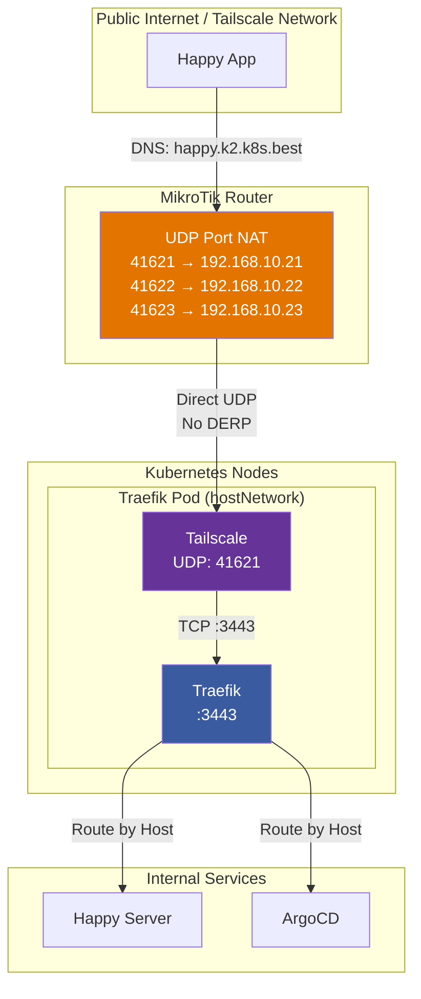

+++
date = '2025-12-01T00:00:00+01:00'
draft = true
publishdate = '2026-01-20T00:00:00+01:00'
tags = ['kubernetes', 'tailscale', 'traefik', 'homelab', 'networking', 'mtls']
title = "Tailscale + Traefik + Private CA: A Hybrid Approach to Homelab Networking"
+++

I run a hybrid networking setup that combines **Tailscale**, **Traefik**, and a **private CA** (powered by OpenBao). In this post, I'll explain why I chose this architecture and how the pieces fit together.

<!--more-->
<!-- toc -->

## The Problem with Pure Tailscale

Tailscale is fantastic for secure, mesh networking. However, there's a well-known limitation when running Tailscale on Kubernetes: **direct connections aren't guaranteed**.

The Tailscale Kubernetes Operator creates proxies in their own network namespace. By design, the operator [cannot easily use host networking](https://tailscale.com/blog/kubernetes-direct-connections) for the pods it creates. This means:

1. **Proxies run behind NAT**: Each proxy pod gets a ClusterIP, and outbound traffic goes through the node's NAT
2. **Symmetric/hard NAT behavior**: Kubernetes networking often exhibits "hard NAT" characteristics where the NAT device uses a different port for every outbound connection
3. **DERP fallback**: When Tailscale detects hard NAT, it falls back to relay connections through DERP servers

As Tailscale's documentation states, they ["can't guarantee direct connections on Kubernetes"](https://tailscale.com/blog/kubernetes-direct-connections) — this is a fundamental limitation of the Kubernetes networking model.

Cloud environments exacerbate this: [AWS NAT Gateways](https://tailscale.com/kb/1445/kubernetes-operator-customization) are particularly known for hard NAT behavior, forcing all traffic through DERP relays.

For my setup, I wanted **direct peer-to-peer connectivity**. DERP relays add latency and become a bottleneck — I have a 10Gbps connection and I want to use all of it for services like my NGINX file server that serves Transmission downloads or any other bandwidth-intensive workload.

I haven't yet run iperf3 to properly benchmark the link, but I was able to download files at 30 MB/s (240 Mbps) while on 5G — which means the connection wasn't going through DERP servers, as those would be significantly slower over a typical mobile connection.

## The Solution: Traefik as the Ingress Layer

The key insight is simple: **route all traffic through Traefik pods running on machines with publicly reachable Tailscale IPs**.



### How It Works

1. **Tailscale provides the public IP**: The Traefik pods run with `hostNetwork: true` on machines that have Tailscale IPs directly accessible from the internet.

2. **Direct connectivity**: Instead of going through DERP servers, clients connect directly to the Traefik pod's Tailscale IP on port 3443.

3. **Traefik handles TLS**: Connections are TLS-terminated at Traefik, which can optionally require client certificates (mTLS) for certain routes.

4. **Load balancing**: Traefik's `weighted-round-robin` load balancing distributes traffic across backend services.

## Why Both Tailscale AND a Private CA?

You might wonder: if Tailscale already provides encryption at the network layer, why add a private CA?

The answer is **defense in depth and future flexibility**:

| Layer | Purpose |
|-------|---------|
| **Tailscale** | Network-level encryption and authentication. Any device on my tailnet can reach Traefik. |
| **Private CA (OpenBao)** | Application-level authentication via mTLS. Certain routes can require valid client certificates. |

This hybrid approach lets me:
- **Leave some routes public** (with forward-auth via OAuth)
- **Require mTLS for sensitive routes** (client certificate required)
- **Have a clean security model** even if Tailscale access is compromised

## The Traefik Configuration

Traefik runs as a `DaemonSet` with `hostNetwork: true`, binding directly to host ports:

```yaml
# Key entrypoints
ports:
  ts-secure:
    port: 3443
    tls:
      enabled: true
```

Routes can be configured with different authentication modes:

```yaml
routes:
  # Tailscale-only access
  happy:
    auth: tailscale-only

  # Tailscale + forward-auth fallback
  argocd:
    auth: tailscale-bypass

  # mTLS required
  sensitive:
    auth: mtls-strict
```

## UDP Port Assignment for Tailscale

Each Traefik/Tailscale pod needs a unique UDP port for the WireGuard tunnel. I use a deterministic formula based on the node's IP address:

```bash
# Extract the last octet of the node's IP
OCTET=$(echo $K8S_NODE_IP | cut -d. -f4)

# Calculate UDP port: base port + node octet
PORT=$((41600 + OCTET))
```

| Node IP | Last Octet | UDP Port |
|--------:|----------:|----------:|
| `192.168.10.21` | 21 | 41621 |
| `192.168.10.22` | 22 | 41622 |
| `192.168.10.23` | 23 | 41623 |

This formula guarantees every node gets a unique port without manual coordination. The base port 41600 is Tailscale's default, and adding the node's last octet creates a deterministic, conflict-free mapping.

### Router Configuration

Since I have only one public IPv4 address, my MikroTik router handles the port mapping. It has pre-configured firewall rules that translate incoming UDP ports to the corresponding node:

```
/ip/firewall/nat add chain=dstnat dst-port=41621 protocol=udp action=dst-nat to-addresses=192.168.10.21 to-ports=41621
/ip/firewall/nat add chain=dstnat dst-port=41622 protocol=udp action=dst-nat to-addresses=192.168.10.22 to-ports=41622
/ip/firewall/nat add chain=dstnat dst-port=41623 protocol=udp action=dst-nat to-addresses=192.168.10.23 to-ports=41623
```

This ensures external connections reach the correct node while keeping the internal routing simple and predictable.

## Future Plans

This setup is the foundation for a more sophisticated security model:

1. **mTLS for workspace pods**: Each workspace could get a unique client certificate
2. **Service-to-service auth**: Pods can authenticate to each other via mTLS
3. **Zero-trust internal networking**: Internal services require validated certificates

I'll explore these possibilities in future posts.

## Conclusion

Combining Tailscale's ease of use with Traefik's flexibility and a private CA for application-level security gives me the best of all worlds. The architecture is more complex, but it provides a clear path to mTLS-based security without sacrificing the simplicity of Tailscale's network mesh.

For most homelabbers, pure Tailscale is the right choice. But if you need direct connectivity, custom TLS termination, or a path to mTLS, this hybrid approach is worth considering.
