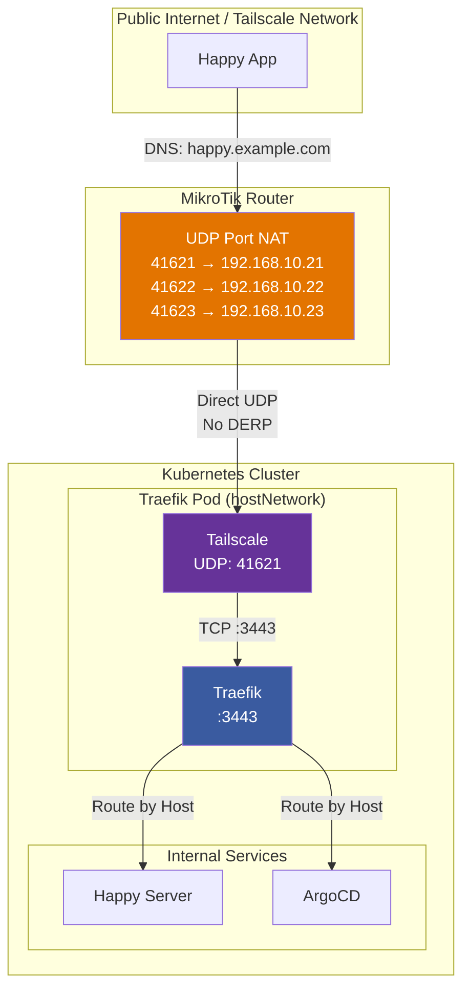
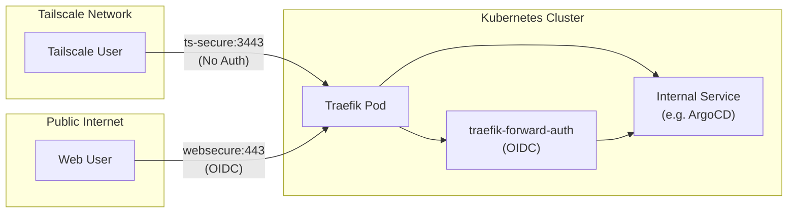

+++
date = '2026-01-12T12:00:00+01:00'
draft = false
publishdate = '2026-01-12T12:00:00+01:00'
tags = ['kubernetes', 'tailscale', 'traefik', 'homelab', 'networking', 'mtls']
title = "Tailscale + Traefik + Private CA: A Hybrid Approach to Homelab Networking"
+++

I run a hybrid networking setup that combines [**Tailscale**](https://tailscale.com/kb/1151/what-is-tailscale) (a mesh VPN), [**Traefik**](https://doc.traefik.io/traefik/) (a cloud-native reverse proxy), and a **private CA** powered by [OpenBao](https://openbao.org) (an open-source secret management and PKI solution forked from HashiCorp Vault).

In this post, I'll explain why I chose this architecture and how the pieces fit together.

<!--more-->
<!-- toc -->

## Background: The Components

Before diving into the problem, let me briefly introduce each component:

- **[Tailscale](https://tailscale.com/kb/1151/what-is-tailscale)**: A zero-config mesh VPN built on [WireGuard](https://tailscale.com/kb/1035/wireguard) that creates secure, peer-to-peer connections between devices. It handles NAT traversal, relay fallback through [DERP servers](https://tailscale.com/kb/1232/derp-servers), and provides authentication through your identity provider.

- **[Traefik](https://doc.traefik.io/traefik/)**: A modern HTTP/TCP reverse proxy and load balancer that integrates with Kubernetes (and other orchestrators) to automatically discover services and route traffic. It supports TLS termination, [mTLS](https://doc.traefik.io/traefik/middlewares/http/passtlsclientcert/) (mutual TLS), middleware for authentication (OIDC, forward-auth), and can run as a DaemonSet with `hostNetwork: true`.

- **[OpenBao](https://openbao.org)**: An open-source secret management solution (a community-driven fork of HashiCorp Vault) that provides secure secret storage, dynamic secrets, and a PKI engine for issuing TLS certificates from a private certificate authority.

## The Problem with Pure Tailscale

Tailscale is fantastic for secure, mesh networking. However, there's a well-known limitation when running Tailscale on Kubernetes: **direct connections aren't guaranteed**.

The Tailscale Kubernetes Operator creates proxies in their own network namespace. By design, the operator [cannot easily use host networking](https://tailscale.com/blog/kubernetes-direct-connections) for the pods it creates. This means:

1. **Proxies run behind NAT**: Each proxy pod gets a ClusterIP, and outbound traffic goes through the node's NAT
2. **Symmetric/hard NAT behavior**: Kubernetes networking often exhibits "hard NAT" characteristics where the NAT device uses a different port for every outbound connection
3. **[DERP](https://tailscale.com/kb/1232/derp-servers) fallback**: When Tailscale detects hard NAT, it falls back to relay connections through DERP servers (Designated Encrypted Relay for Packets)

As Tailscale's documentation states, they ["can't guarantee direct connections on Kubernetes"](https://tailscale.com/blog/kubernetes-direct-connections) — this is a fundamental limitation of the Kubernetes networking model.

Cloud environments exacerbate this: [AWS NAT Gateways](https://tailscale.com/kb/1445/kubernetes-operator-customization) are particularly known for hard NAT behavior, forcing all traffic through DERP relays.

For my setup, I wanted **direct peer-to-peer connectivity**. [DERP relays](https://tailscale.com/kb/1232/derp-servers) add latency and become a bottleneck — according to Tailscale's documentation, "[relayed connections] typically have higher latency" and "peer relays offer lower latency and better performance than DERP servers"[^derp]. I have a 10Gbps connection and I want to use all of it for services like my NGINX file server that serves Transmission downloads or any other bandwidth-intensive workload.

I haven't yet run iperf3 to properly benchmark the link, but I was able to download files at 30 MB/s (240 Mbps) while on 5G — which means the connection wasn't going through DERP servers, as those would be significantly slower over a typical mobile connection.

My homelab has only **one public IPv4 address**, which is a common constraint for residential and small ISP connections. This means I can't assign a unique public IP to each node. Instead, I need to use port mapping (NAT) on my router to direct traffic to the correct node.

## The Solution: Traefik as the Ingress Layer

The key insight is simple: **route all traffic through Traefik pods running on machines with publicly reachable Tailscale IPs**.



### How It Works

1. **Tailscale provides the public IP**: The Traefik pods run with `hostNetwork: true` on machines that have Tailscale IPs directly accessible from the internet.

2. **Direct connectivity**: Instead of going through DERP servers, clients connect directly to the Traefik pod's Tailscale IP on port 3443.

3. **Traefik handles TLS**: Connections are TLS-terminated at Traefik, which can optionally require [client certificates (mTLS)](https://doc.traefik.io/traefik/middlewares/http/passtlsclientcert/) for certain routes.

4. **Load balancing**: Traefik's `weighted-round-robin` load balancing distributes traffic across backend services.

## Why Both Tailscale AND a Private CA?

> **Note:** I don't yet use mTLS in my new cluster setup. I already have a private CA running on OpenBao, but I'm only using it for server authentication (TLS certificates for services). Client certificate authentication is a long-term plan to maintain a Tailscale / mTLS hybrid approach. The architecture described here is the target state I'm working toward.

Two access paths for different use cases:

| Method | Best For | Battery Impact |
|--------|----------|----------------|
| **[Tailscale](https://tailscale.com/kb/1151/what-is-tailscale)** | Laptops, desktops, servers | Minimal (always-on anyway) |
| **[mTLS](https://doc.traefik.io/traefik/middlewares/http/passtlsclientcert/)** | Mobile devices | None (no background service) |

### The Problem with Tailscale on Mobile

[Tailscale](https://tailscale.com/kb/1151/what-is-tailscale) is excellent for permanent devices, but it keeps the [WireGuard](https://tailscale.com/kb/1035/wireguard) tunnel active in the background. User reports and official documentation indicate noticeable battery drain on phones[^tailscale-battery], with exit node usage being a primary contributor. For my Android devices, I needed a cleaner alternative.

### The Solution: mTLS as Tailscale Alternative

Both paths terminate at Traefik on the same port (3443). The difference is how the client authenticates:

- **Tailscale**: Device has a tailnet identity
- **mTLS**: Client presents a valid certificate signed by my private CA

### Per-Service Access Control

Access method is determined by DNS — each service gets one or the other:

| DNS Record | Access Method | Example |
|------------|---------------|---------|
| `*.example.com` → Public IP | [mTLS](https://doc.traefik.io/traefik/middlewares/http/passtlsclientcert/) (internet) | Web apps (Prometheus, Grafana) |
| `*.example.com` → [Tailscale](https://tailscale.com/kb/1151/what-is-tailscale) IP | Tailscale-only | Internal tools, Immich |

A service cannot be both — it's one or the other based on which IP the DNS resolves to.

### Why Some Services Need Tailscale

The reason is **broken [mTLS](https://doc.traefik.io/traefik/middlewares/http/passtlsclientcert/) support** in some applications. Take [Immich](https://immich.app) (a self-hosted photo management solution) as an example.

**Issue #15230** ([meta: experimental network features](https://github.com/immich-app/immich/issues/15230)) documents that Immich's mTLS implementation is fundamentally broken:

- mTLS, self-signed certs, and user-installed CAs are marked as **experimental features**
- They **don't work reliably**: video playback, foreground/background uploads, downloads, and app crashes are all affected
- The maintainers explicitly state these are **not a priority**

**My PR #22768** ([better mTLS support](https://github.com/immich-app/immich/pull/22768)) attempted to fix this by integrating OkHttp with proper Android trust store support. However, it was closed with:

> "In its current form, it doesn't address the underlying issue and contains significant implementation flaws."

The maintainers have explicitly stated they won't prioritize fixing this issue and closed my PR. Until Immich ships a proper mTLS implementation, it **must remain Tailscale-only** — the network-layer authentication is the only reliable security boundary.

This is the value of my hybrid approach: I can enforce security at the network layer when the application layer is broken.

### Unified Security Model

Both paths terminate at Traefik, which enforces consistent routing and authentication policies regardless of origin. Whether a client came through Tailscale or the internet, Traefik applies the same rules to the backend service.

## The Traefik Configuration

Traefik runs as a `DaemonSet` with `hostNetwork: true`, binding directly to host ports:

```yaml
# Key entrypoints
ports:
  ts-secure:
    port: 3443
    tls:
      enabled: true
```

Routes can be configured with different authentication modes:

```yaml
routes:
  # Tailscale-only: accessible only from within the tailnet
  internal-tool:
    auth: tailscale-only

  # Tailscale + [OIDC](https://openid.net/connect/): direct access from tailnet, or internet access via OIDC identity provider
  shared-service:
    auth: tailscale-bypass

  # [mTLS](https://doc.traefik.io/traefik/middlewares/http/passtlsclientcert/) required: client certificate required for all access
  sensitive-api:
    auth: mtls-strict
```

The `tailscale-bypass` mode creates two IngressRoutes:



| EntryPoint | Access | Authentication |
|------------|--------|----------------|
| `ts-secure` | From [Tailscale](https://tailscale.com/kb/1151/what-is-tailscale) network | None (direct access) |
| `websecure` | From internet | [OIDC](https://openid.net/connect/) via `forward-auth` middleware |

This allows internal users fast, auth-free access while external users authenticate through an identity provider like Auth0 or Google Workspace.

## UDP Port Assignment for Tailscale

Each Traefik/[Tailscale](https://tailscale.com/kb/1151/what-is-tailscale) pod needs a unique UDP port for the [WireGuard](https://tailscale.com/kb/1035/wireguard) tunnel. I use a deterministic formula based on the node's IP address:

```bash
# Extract the last octet of the node's IP
OCTET=$(echo $K8S_NODE_IP | cut -d. -f4)

# Calculate UDP port: base port + node octet
PORT=$((41600 + OCTET))
```

| Node IP | Last Octet | UDP Port |
|--------:|----------:|----------:|
| `192.168.10.21` | 21 | 41621 |
| `192.168.10.22` | 22 | 41622 |
| `192.168.10.23` | 23 | 41623 |

This formula guarantees every node gets a unique port without manual coordination. I use 41600 as the base (you can use any port, Tailscale's default is 41641[^ports]), and adding the node's last octet creates a deterministic, conflict-free mapping (e.g., 41621 = 41600 + 21).

### Router Configuration

Since I have only one public IPv4 address, my MikroTik router handles the port mapping. It has pre-configured firewall rules that translate incoming UDP ports to the corresponding node:

```
/ip/firewall/nat add chain=dstnat dst-port=41621 protocol=udp action=dst-nat to-addresses=192.168.10.21 to-ports=41621
/ip/firewall/nat add chain=dstnat dst-port=41622 protocol=udp action=dst-nat to-addresses=192.168.10.22 to-ports=41622
/ip/firewall/nat add chain=dstnat dst-port=41623 protocol=udp action=dst-nat to-addresses=192.168.10.23 to-ports=41623
```

This ensures external connections reach the correct node while keeping the internal routing simple and predictable.

## Future Plans

This setup is the foundation for a more sophisticated security model:

1. **Enable mTLS with existing CA**: Extend my [OpenBao](https://openbao.org) PKI setup to support client certificate authentication
2. **Expand mTLS services**: Move more services to public mTLS access as apps get fixed
3. **Service-to-service auth**: Pods authenticate to each other via mTLS certificates
4. **Per-device certificates**: Issue certificates with device-specific metadata for audit trails
5. **Zero-trust internal networking**: Internal services require validated certificates regardless of origin

I'll explore these possibilities in future posts.

## Why This Hybrid Approach?

You might wonder: why not just use [Tailscale](https://tailscale.com/kb/1151/what-is-tailscale) for everything, or just use a reverse proxy with mTLS? Each approach has tradeoffs:

| Approach | Pros | Cons |
|----------|------|------|
| **Tailscale-only** | Zero config, works everywhere, built-in authentication | Battery drain on mobile, DERP relay dependency, some apps don't work well |
| **mTLS-only** | No battery impact, full control, works with any client | Complex certificate management, every app needs mTLS support |
| **Hybrid (my approach)** | Best of both worlds, defense-in-depth | More complex infrastructure, requires both systems |

## Conclusion

Combining [Tailscale's](https://tailscale.com/kb/1151/what-is-tailscale) ease of use with [Traefik's](https://doc.traefik.io/traefik/) flexibility and a private CA powered by [OpenBao](https://openbao.org) gives me the best of all worlds:

- **Battery-efficient mobile access** via mTLS
- **Tailscale for apps with broken mTLS** implementations
- **Defense in depth** with multiple authentication layers
- **Flexibility to choose per service** based on requirements

The architecture is more complex, but it provides a clear path to internet-accessible services without Tailscale while keeping sensitive tools restricted to the tailnet.

[^derp]: [Tailscale DERP Servers](https://tailscale.com/kb/1232/derp-servers) - Designated Encrypted Relay for Packets
[^ports]: [Tailscale Connection Types](https://tailscale.com/kb/1257/connection-types) - Direct vs relayed connections
[^tailscale-battery]: [Tailscale battery drain on mobile](https://tailscale.com/kb/1023/troubleshooting#mobile-device-battery-drains-too-quickly) - Known issue tracked in [GitHub #13725](https://github.com/tailscale/tailscale/issues/13725)
